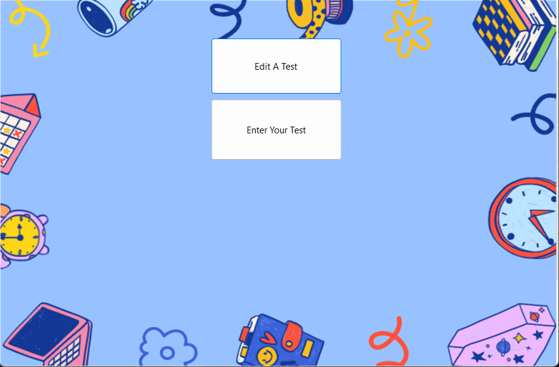
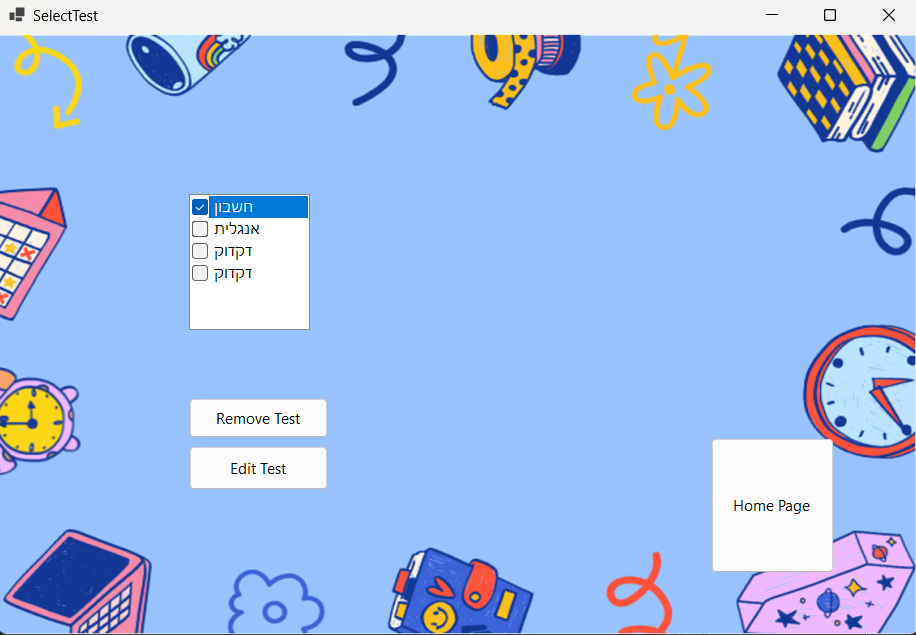
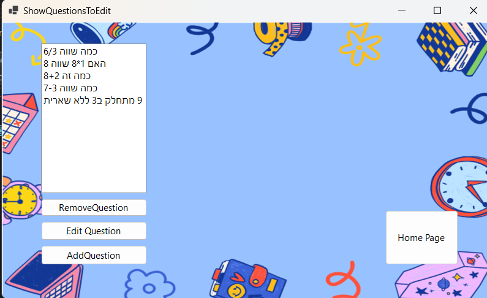
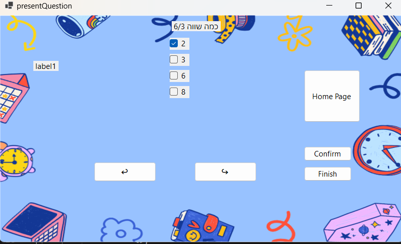

# Exam Management System
### Developed by Malki Applebaum ✍️

## Description
The **Exam Management System** is a C# WinForms-based application designed for managing and conducting exams. The system is divided into two main user roles: **Teachers** and **Students**. 

- **Teachers** can create, edit, delete, and save exams.
- **Students** can log in, select exams to take, and view their results upon completion.

This application provides a simple and intuitive interface for handling the entire lifecycle of exams, from creation to evaluation.

---
## Screenshots

### Teacher Dashboard:
<p float="left">
    
    
    
</p>

### Student Exam Interface:
<p float="left">
    
    
</p>
## Features

### For Teachers:
1. **Create Exams**  
   Teachers can create new exams by adding questions and answers, including multiple-choice and other formats.
   
2. **Edit and Update Existing Exams**  
   Teachers can modify saved exams to update questions or answers as needed.

3. **Delete Exams**  
   Teachers can delete outdated or unnecessary exams from the system.

4. **Save Exams**  
   Exams can be saved to the system for future use.

---

### For Students:
1. **Login and Exam Selection**  
   Students can log in to the system, browse available exams, and select the one they wish to take.

2. **Take Exams**  
   Students can answer questions and submit their responses within the system.

3. **View Results**  
   After completing an exam, students receive immediate feedback on their performance, including their final score.

---

## Technologies Used
- **C# (.NET Framework)**: The core programming language used to develop the application.
- **Windows Forms**: Provides a graphical user interface for creating, managing, and taking exams.
- **Database Integration**: (Optional, depending on implementation) Saves exam data, student responses, and results.

---

## Installation Instructions
1. Clone this repository:
   ```bash
   git clone https://github.com/MalkiApplebaum/TeacherStudentExamApp.git
